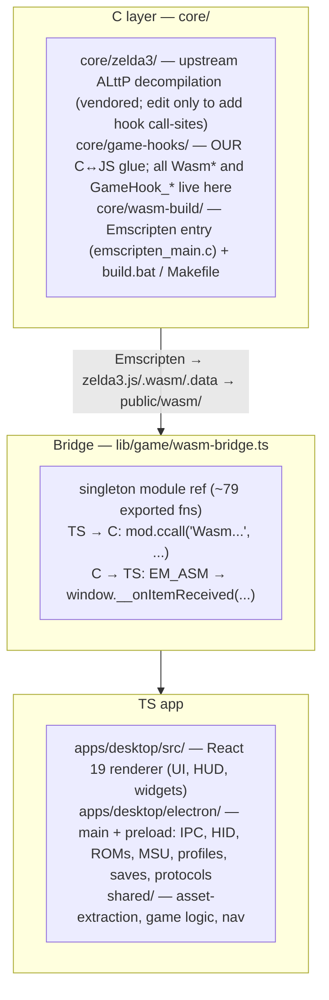

<!-- @layer root-config @kind doc -->
# Relic of the Past — Project Guide

A desktop port of *The Legend of Zelda: A Link to the Past*, built by wrapping a
decompiled C reimplementation of the game in WebAssembly and driving it from a
React UI inside Electron.

## Architecture — three layers

The **WASM bridge is the trickiest part of the codebase**: any new function that
crosses the C↔TS boundary touches **two places** — the C impl in
`core/game-hooks/*.c` (tagged `EMSCRIPTEN_KEEPALIVE`, which both retains *and*
exports the symbol — there is **no** `EXPORTED_FUNCTIONS` list to maintain), and
the `ccall` site in `apps/desktop/src/lib/game/`. C→JS events go the other way via `EM_ASM` →
`window.__on*`. Full procedure: the `add-wasm-function` skill. Rebuild after any C
change: the `build-wasm` skill (C edits don't take effect until rebuilt).

## Directory map

| Path | What lives here |
|------|-----------------|
| `core/zelda3/` | Upstream C decompilation + SNES emulation. Treat as vendored. |
| `core/game-hooks/` | Our C hook layer — `Wasm*` exports, `GameHook_*` callbacks, cheats, state queries, haptics. |
| `core/wasm-build/` | Emscripten build (`build.bat`, `Makefile`, `emscripten_main.c`). |
| `apps/desktop/src/` | React renderer. `lib/game/` is the JS side of the bridge; `stores/` are Zustand stores; `hud/`, `widgets/`, `components/`. |
| `apps/desktop/electron/` | Electron main process + preload (Node-side: input, ROM loading, profiles, saves). |
| `shared/` | Code shared between renderer & electron. `asset-extraction/` (ROM→.dat pipeline), `game/` (logic, navigation, checks, seeds), `types/`. |
| `tests/` | `vitest` unit tests (`*.test.ts`) + `playwright` specs (`*.spec.ts`, screenshots). |
| `scripts/` | Out-of-band tooling: `analyze/` (quality + tagging harness), `copyright-gate/`, `build/` (packaging config), `hooks/` (agent lint hook), `analyze-navigation.ts` (offline nav extraction). |
| `docs/` | Project documentation. |

Path aliases: `@shared/*` → `shared/`, `@app/*` → `apps/desktop/src/`.

## Build & run

> ⚠️ **The WASM core auto-builds.** `npm run dev` / `npm run build` run an
> `ensure-wasm` pre-step (scripts/ensure-wasm.mjs) that (re)builds
> `apps/desktop/public/wasm/zelda3.{js,wasm}` when it is **missing or any C source is
> newer** than the last build — otherwise it's a fast no-op. The wasm is **gitignored**
> (not committed); the build needs Emscripten (`$EMSDK`, default `E:\GameProjects\emsdk`).
> `npm install` likewise auto-fetches the Electron binary (`ensure-electron`). C changes
> take effect on the next `dev`/`build`; force a rebuild with `npm run ensure-wasm` or
> the `build-wasm` skill.

| Task | Command | Notes |
|------|---------|-------|
| Run the app (dev) | `npm run dev` | electron-vite dev server + Electron. |
| Build the app | `npm run build` | electron-vite production build. |
| Lint + typecheck | `npm run lint` | `tsc --noEmit && eslint .` |
| **Analyze whole project** | `npm run analyze` | Classifies + lints **all** file types; `analyze:diff`/`:ci`/`:tag`. See @docs/contributing/file-tagging.md. |
| **Build WASM** | auto on `dev`/`build`; force: `npm run ensure-wasm` | Rebuilds when missing/stale (needs emsdk). Explicit/manual: `build-wasm` skill → `core/wasm-build/build.bat`. |
| Unit tests | `npx vitest run tests/<file>` | Run only the relevant file, not the whole suite. |
| E2E / screenshots | `npx playwright test` | |

The app needs a user-provided ROM/assets (`assets/*.sfc`, `assets/assets.dat`) —
these are gitignored and never committed. Same for `test-roms/` and `saves/`.

## Conventions

- **Coding standards are strict, documented, and enforced:** @docs/contributing/coding-standards.md
  — arrow functions only, exports grouped at end, **≤200 lines/file**,
  one-thing-per-file, deep logical folders, `import type`. Enforced by
  `eslint.config.mjs` + a PostToolUse lint hook that flags violations on every
  edit. Run the `coding-standards` skill's checkup after every change.
- **Every file is tagged & analyzed: @docs/contributing/file-tagging.md.** Each file carries
  `@layer`/`@kind` (header or `file-tags.jsonc` manifest). `npm run analyze` runs
  one harness over **all** languages (line-policy + eslint + tsc + stylelint +
  markdownlint + clang-format); vendored `core/zelda3` is hint-only. Size is
  per-kind (baseline 200; data/generated/asset exempt). A Stop hook gates changed
  files each turn (`analyze:ci`). New file → tag it (`npm run analyze:tag`).
- **Clean code — `refactoring-guru` skill.** Be an expert: recognize code smells,
  apply the right refactoring, choose/explain design patterns, uphold SOLID. Spot
  smells and pattern opportunities as you touch code and suggest/perform refactors.
  Cite refactoring.guru pages when explaining.
- **Plan format: @docs/contributing/plan-format.md.** Every implementation plan is concise and
  shows: design pattern(s) + why, a **CRUD filetree** (A/M/D/R markers), the
  **data model in real TS code**, key code blocks, and a **flow/preview diagram
  generated with the asciiflow MCP server** (pasted inline). Show, don't narrate.
- **Architecture: @docs/architecture/overview.md.** The zone map + **dependency invariants**
  - a placement guide. **Analyze every feature before building** — decompose, place
  each piece in the right zone, verify boundaries, then plan. Use the `architecture` skill.
- **Design system: @docs/contributing/design-system.md.** Tokens (`design-system/`) are the single
  source of truth (no raw hex / magic px). Four component tiers live in
  `components/{primitives,composites,compounds,views}/` — primitive/composite/compound
  are bare & presentational; **view** is the only tier with logic/data. Use the
  `design-system` skill.
- **Testing: @docs/contributing/testing.md.** **Always launch the app for tests
  with `--no-focus --muted`** so it never steals focus (dev: `npm run dev -- -- --no-focus --muted`).
  Prefer built-in automation flags (`--auto-state`, `--screenshot`, `--dump-layers`,
  `--dump-nav`) over Playwright.
  Playwright is **ephemeral** — throwaway specs in `tests/scratch/`, deleted after
  use. Files marked "NEVER MODIFIED BY THE AI" are protected — **modify only with
  the user's explicit permission** (stop and ask). Use the `test-app` skill.
- Skills: `architecture`, `refactoring-guru`, `coding-standards`, `design-system`,
  `electron`, `test-app`, `build-wasm`, `add-wasm-function`, `interpret-game-screenshot`.
- `core/` (C) is **excluded** from `tsconfig` — don't expect TS tooling there.
- **`core/zelda3/` is OUT OF SCOPE** — it is the vendored upstream decompilation.
  Never read it for review, refactor it, "clean it up", or include it in
  consistency/dead-code/standards sweeps **unless the user explicitly asks you to
  refactor it**. It does not follow this repo's coding standards and never will;
  the analyzer treats it as hint-only by design. The **only** routine edit allowed
  is inserting a single `GameHook_*` call-site at a game event — and the logic
  behind that hook is **ours**, lives in `core/game-hooks/`, and *is* in scope. So:
  a `GameHook_*` function or its wiring is fair game even though it sits next to
  vendored code; the surrounding decompiled C is not.
- **Before flagging code as dead, check the intentional-unused registry** in
  @docs/architecture/codebase-audit.md. Headless/`--command` WASM exports and WIP
  integration scaffolding (randomizer delivery, unwired navigation primitives) have
  **no renderer caller by design** — that doc also holds the project health snapshot,
  communication map, and remediation log; update it after any cross-cutting refactor.
- WASM exports rely on `EMSCRIPTEN_KEEPALIVE` (the single source of truth), so
  `build.bat` and `Makefile` carry no per-function `EXPORTED_FUNCTIONS` list to
  keep in sync. `build.bat` is the canonical build used for the app.

## Reading game screenshots (overlays, pathfinding, sprites)

The user frequently shares screenshots of the running game to explain bugs — and
low-res pixel art at scale is easy to misread (something wrong gets read as fine).

- Use the `interpret-game-screenshot` skill and @docs/architecture/rendering-pixel-art.md.
- Reason in **tiles** (8px base, 16px collision, 512px screen), not vague position.
- When judging whether a sprite is right/placed correctly, **fetch the real
  extracted sprite** from `%AppData%\relic-of-the-past\sprites\<rom-stem>\*.png`
  and compare — don't eyeball.
- **STANDING RULE — flag missing sprites.** Only HUD/item/menu sprites are
  extracted; Link, enemies, NPCs, and overworld/dungeon tiles are **not**. If
  reading a screenshot reliably needs a sprite that isn't extracted, **stop and
  raise a flag** naming the exact sprite so the user can extract it. Do this
  **iteratively, one at a time, as needed** — never request a bulk extraction.

## Asset extraction (`shared/asset-extraction/`)

Pure-TS port of the Python tools in `core/zelda3/assets/`. Reads a user ROM
(`.sfc`) → produces the `zelda3_assets.dat` blob the game core loads.
Flow: `rom/` (load + SNES↔linear addressing) → `compression/` (LZ, BRR) →
`graphics/` (2/3/4bpp tile decode, palettes) → `compile-*.ts` (per-domain
extractors) → `asset-builder.ts` (serializes the `.dat`). Public barrel: `index.ts`.

- One `compile-*.ts` per asset domain — match that granularity when adding extractors.
- ROM addresses are SNES addresses — convert with `snesToLinear` before indexing a
  linear buffer; never hardcode linear offsets.
- Validate against `ZELDA3_SHA1` / `ZELDA3_SHA1_US` so the wrong ROM fails loudly.
- Tests in `tests/asset-extraction/` (`npx vitest run tests/asset-extraction/<file>`).

## Key files to know

- `apps/desktop/src/lib/game/wasm-bridge.ts` — the bridge singleton + most `ccall`s.
- `core/game-hooks/state_queries.c` — pattern for returning data to JS via pointers + `HEAPU8`.
- `core/game-hooks/game_hooks.h` — declared hook surface.
- `core/wasm-build/build.bat` — the build everyone actually runs.
- `docs/architecture/navigation.md` — design of the pathfinding/minimap system (active area of work).
