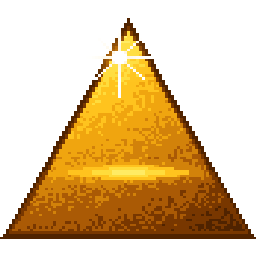
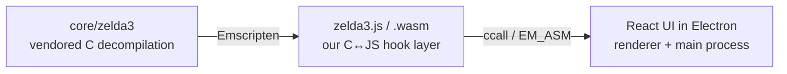

<!-- @layer root-config @kind doc -->
<div align="center">



# Relic of the Past

**A modern, cross-platform desktop launcher for the open-source *A Link to the Past* PC port —
polished UI, controller support, save profiles, MSU-1 audio, and randomizer tooling.**

[](https://relic-of-the-past.com)
[](https://discord.gg/jBkmwzKHZN)
[](https://github.com/drizztdourden08/relic-of-the-past/actions/workflows/ci.yml)
[](https://github.com/drizztdourden08/relic-of-the-past/releases)
[](LICENSE)
[](#installation)
[](#how-it-works)

**Project status:** Pre-release / Beta — actively developed, expect rough edges.

</div>

---

> [!IMPORTANT]
> **Disclaimer.** This is an unofficial fan-made/open-source project. It is not affiliated with,
> endorsed by, sponsored by, or approved by Nintendo. Nintendo, The Legend of Zelda, and related
> names, characters, music, artwork, and assets are trademarks and/or copyrights of Nintendo.
> **No Nintendo-owned game assets are included in this repository — you must provide your own
> legally obtained ROM.**

## Community

| Type | Link |
|----------|----------|
| [](https://relic-of-the-past.com) | <https://relic-of-the-past.com> |
| [](https://discord.gg/jBkmwzKHZN) | <https://discord.gg/jBkmwzKHZN> |
| [](https://github.com/drizztdourden08/relic-of-the-past/issues) | <https://github.com/drizztdourden08/relic-of-the-past/issues> |

## What is this?

Relic of the Past wraps a decompiled C reimplementation of the game (compiled to WebAssembly) in a
React UI inside Electron, giving the classic PC port a first-class desktop experience: a real
launcher, per-game save profiles, controller remapping and haptics, MSU-1 music packs, display and
HUD options, and an in-progress randomizer tracker.

It ships **no game data**. On first run you point it at your own ROM; the app extracts the assets it
needs locally on your machine.

## Installation

Download the latest build for your platform from the
[**Releases**](https://github.com/drizztdourden08/relic-of-the-past/releases) page:

| Platform | Download |
|----------|----------|
| Windows  | Portable `.exe` or Installer `.exe` |
| macOS \* | `.dmg` |
| Linux    | `.AppImage` or `.deb` |

\* Special instruction. See [here](https://github.com/drizztdourden08/relic-of-the-past/wiki/Getting-Started-Installation#relic-of-the-past-is-damaged-and-cant-be-opened).

Then launch the app and select your ROM when prompted. See the [Quick Start](docs/getting-started/quick-start.md)
and [Installation](docs/getting-started/installation.md) guides for details.

## Build from source

Requires **Node.js ≥ 24** (see [`.nvmrc`](.nvmrc)). The WebAssembly core is committed prebuilt, so a
normal build does **not** need the Emscripten SDK.

```bash
npm install        # install dependencies
npm run dev        # run the app in development
npm run build:win  # produce a packaged build (see package.json for mac/linux)
```

Quality checks (run by CI on every push/PR):

```bash
npm run ci         # tsc + eslint + repo analysis
```

> Rebuilding the WebAssembly core is a separate manual step and is only needed when changing C code
> under `core/`. See `core/wasm-build/` and the project docs.

## How it works



A three-layer architecture: the vendored C decompilation, our C↔JS hook layer compiled to WASM, and
the TypeScript/React renderer.

## Documentation

The full documentation lives in **[`docs/`](docs/)** (also published to the project Wiki):

- **Start here:** [Quick Start](docs/getting-started/quick-start.md) · [Installation](docs/getting-started/installation.md)
- **User guide:** [profiles](docs/user-guide/profiles.md), [save states](docs/user-guide/save-states.md), [controllers](docs/user-guide/input-controllers.md), [MSU audio](docs/user-guide/audio-msu.md), [HUD](docs/user-guide/hud.md), and more under [docs/user-guide/](docs/user-guide/)
- **Architecture:** [overview](docs/architecture/overview.md) · [the WASM bridge](docs/architecture/wasm-bridge.md) · [asset extraction](docs/architecture/asset-extraction.md)
- **Game hooks reference:** [the C↔JS boundary](docs/hooks/overview.md) — every `Wasm*` export & callback
- **Contributing:** [guide](docs/contributing/index.md) · [coding standards](docs/contributing/coding-standards.md) · [design system](docs/contributing/design-system.md)

## Credits & license

This project stands on the shoulders of the open-source community — see [CREDITS.md](CREDITS.md).
Application code is released under the [MIT License](LICENSE).

> **Side note — third-party code & trademarks.** The MIT license covers only the
> application code authored in this repository. It does **not** cover the vendored
> upstream decompilation under `core/zelda3/`, which is distributed under its own
> license — see [`core/zelda3/LICENSE.txt`](core/zelda3/LICENSE.txt).
>
> This is an unofficial fan-made / open-source project, not affiliated with, endorsed
> by, sponsored by, or approved by Nintendo. Nintendo, The Legend of Zelda, and related
> names, characters, music, artwork, and assets are trademarks and/or copyrights of
> Nintendo. No Nintendo-owned game assets are included in this repository.
