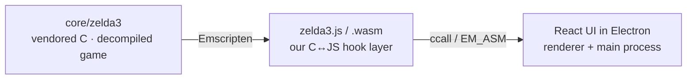

<!-- @layer docs @kind doc -->
# Relic of the Past

A modern, cross-platform desktop launcher for the open-source *A Link to the Past* PC port,
with polished UI, controller support, save profiles, MSU-1 audio, visual enhancements, and
in-progress randomizer tooling. It wraps a decompiled C reimplementation of the game (compiled
to WebAssembly) in a React UI inside Electron.

> [!IMPORTANT]
> This is an unofficial fan-made/open-source project, **not affiliated with Nintendo**. It ships
> **no game data**. On first run you point it at your own legally obtained ROM and the app
> extracts the assets it needs locally.

## Where to go

| If you want to | Start here |
|-----------------|------------|
| **Play**: install and get running fast | [Quick Start](getting-started/quick-start.md) · [Installation](getting-started/installation.md) |
| **Learn a feature**: saves, controllers, HUD, MSU, cheats, and more | [User Guide](user-guide/profiles.md) |
| **Understand the floating panels** | [Widgets](widgets/overview.md) |
| **Understand how it's built** | [Architecture](architecture/overview.md) |
| **Read/drive the running game from JS** | [Game Hooks Reference](hooks/overview.md) |
| **Contribute code** | [Contributing Guide](contributing/index.md) |

## The three layers in one picture

- **C / WASM core** (`core/`): the vendored decompilation plus *our* hook layer (`game-hooks/`)
  that exposes ~79 `Wasm*` functions and fires `GameHook_*` callbacks. See
  [The WASM Bridge](architecture/wasm-bridge.md).
- **Bridge** (`apps/web/src/lib/game/`): the only TypeScript that talks to the WASM module.
- **TS app:** the Electron main process (ROMs, profiles, saves, HID) and the React renderer
  (UI, HUD, widgets, navigation overlay).

## Status

Pre-release and in active development, so expect rough edges.

---

> 📌 **This wiki is generated from the [`docs/`](https://github.com/drizztdourden08/relic-of-the-past/tree/master/docs)
> folder in the main repo, which is the source of truth.** Edit the docs there; the wiki is synced
> automatically. Don't edit wiki pages directly (changes will be overwritten).
