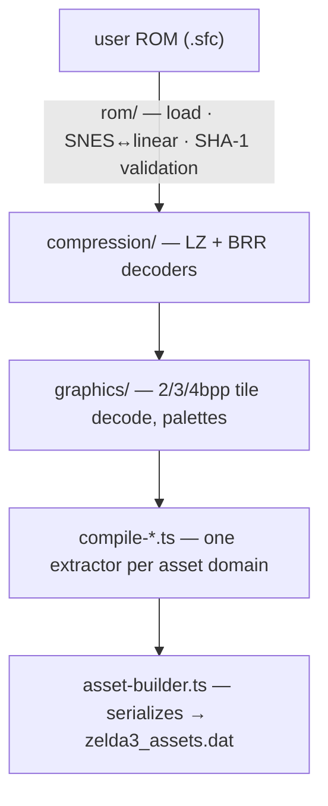

<!-- @layer docs @kind doc -->
# Asset-Extraction Pipeline

The app ships **no game data**. On first run it reads the user's ROM and produces the
`zelda3_assets.dat` blob the game core loads. That extraction is a **pure-TypeScript** port of the
Python tools in `core/zelda3/assets/`, living in `shared/asset-extraction/`.

## Flow

Public surface is the barrel `shared/asset-extraction/index.ts`.

## Layout

| Path | Role |
|------|------|
| `rom/` | ROM loading; **SNES address → linear** conversion (`snesToLinear`). |
| `compression/` | LZ decompression, BRR audio. |
| `graphics/` | Tile/bitplane decode, palette assembly. |
| `text/` · `music/` · `data/` · `extraction/` · `item-sprites/` | Domain helpers. |
| `compile-*.ts` | One file per domain: `graphics`, `dungeons`, `dungeon-rooms`, `dungeon-entrance`, `overworld`(+`-exits`/`-sprites`/`-travel`/`-utils`), `dialogue`, `sound`, `resources`. |
| `asset-builder.ts` | Serializes everything into the `.dat`. |

## Rules

- **Match the granularity:** one `compile-*.ts` per asset domain — add a new file, don't bolt onto an existing one.
- **Addresses are SNES addresses.** Always convert with `snesToLinear` before indexing a linear
  buffer — never hardcode linear offsets.
- **Validate the ROM** against `ZELDA3_SHA1` / `ZELDA3_SHA1_US` so the wrong ROM fails loudly.
- Tests live in `tests/asset-extraction/` — run only the relevant file
  (`npx vitest run tests/asset-extraction/<file>`).

## Where it runs

Extraction is driven from the Electron main process when a profile/ROM is imported (see
[Data Manager](../user-guide/data-manager.md) and [Importing a ROM](../getting-started/importing-a-rom.md)).
Because `shared/` is the leaf zone, the extractor stays pure and testable — no Electron or DOM
dependencies (see the [architecture invariants](overview.md)).
