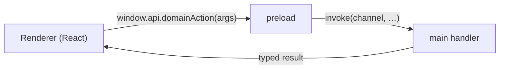

<!-- @layer docs @kind doc -->
# Electron & IPC

The Electron main process owns everything the renderer can't: the filesystem, native modules
(HID/USB), windows, protocols, and all ROM/profile/save I/O. The renderer reaches it only through
IPC, never by importing main-process code (an [architecture invariant](overview.md)).

## The boundary

Every channel's signature lives once, in a channel-keyed contract under
`shared/ipc/`. The preload, the main-process handlers, and the renderer's
`window.api` are all type-checked against it, so a wrong channel name, argument,
or return type is a compile error in any of the three.

- Contracts (`shared/ipc/`) are the single source of truth, split by direction:
  `InvokeContract` (request→response, `invoke`/`handle`), `SendContract`
  (fire-and-forget renderer→main, `send`/`on`), and `EventContract` (main→renderer,
  `emit`/`subscribe`).
- The join map (`shared/ipc/maps.ts`) is the only table linking a friendly
  `window.api` method name to its channel. `IpcApi` (the `window.api` type, in
  `env.d.ts`) is derived from the contracts and maps, so a method's signature is
  never hand-written twice.
- Typed wrappers cover both sides. Main uses `handle`/`on`/`emit` (`electron/lib/ipc/handle.ts`);
  preload uses `invoke`/`send`/`subscribe` plus the `buildInvoke`/`buildSend`/`buildEvents`
  factories (`electron/lib/ipc/bridge.ts`). Raw `ipcMain`/`ipcRenderer`/
  `webContents.send` appear only in these two files.
- The preload's flat methods are generated from the maps; nested namespaces
  (`updater`, `shadowCasting`, `screenEditor`) are wired explicitly via `invoke`.
- Each domain registers its handlers via a `register*()` function, wired in
  `main.ts` through the declarative `IPC_HANDLERS` list (dev-only domains gated there).
- To add a channel, see [Adding an IPC Channel](../contributing/adding-an-ipc-channel.md)
  or the `electron` skill.

## Domains (`apps/desktop/electron/`)

| Domain | Responsibility |
|--------|----------------|
| `profiles/` | Profile CRUD, last-played, app state. |
| `roms/` | Import (file/URL), list, delete, ROM info. |
| `assets/` | Check / load / extract `zelda3_assets.dat`. |
| `saves/` | Save-state slots, screenshots, auto-state, config read/write. |
| `sprites/` | Per-ROM sprite extraction + the sprite-debug store. |
| `languages/` | Translation extraction + dialogue. |
| `msu/` | MSU-1 pack import, listing, track files. |
| `input/` | Input profiles + stick/trigger calibration; HID enumeration, read, write, vibrate. |
| `connections/` · `screen-editor/` | Navigation connection/nav review + (dev) screen editing. |
| `shadow-casting/` | Per-screen heightmap + lighting data. |
| `sessions/` | Play-session history. |
| `updater/` | Auto-update check/download/install. |
| `protocol/` | Custom protocols (e.g. `app-sprite://`). |
| `window/` · `dialogs/` | Window state (fullscreen, always-on-top, aspect lock), native dialogs. |
| `debug/` · `test/` | `--dump-layers`/`--dump-nav` exporters and `--auto-state`/`--screenshot` test hooks. |

## Native modules

The SDL3 controller addon lives only in the main process, not in `shared/` or the renderer.
Controller input is read in main and forwarded to the renderer already decoded, via the
`controller:*` channels; see [Input & Controllers](../user-guide/input-controllers.md) and
[Haptics](../user-guide/haptics.md).

## CLI / automation flags

The main process parses argv for automation: `--no-focus`, `--muted`, `--auto-state=N`,
`--screenshot=NAME`, `--dump-layers=N` (+`--hover-tile=col,row`), `--dump-nav=N`, `--auto-flood`.
See [Testing](../contributing/testing.md) and [Developer Tools](../user-guide/developer-tools.md).
