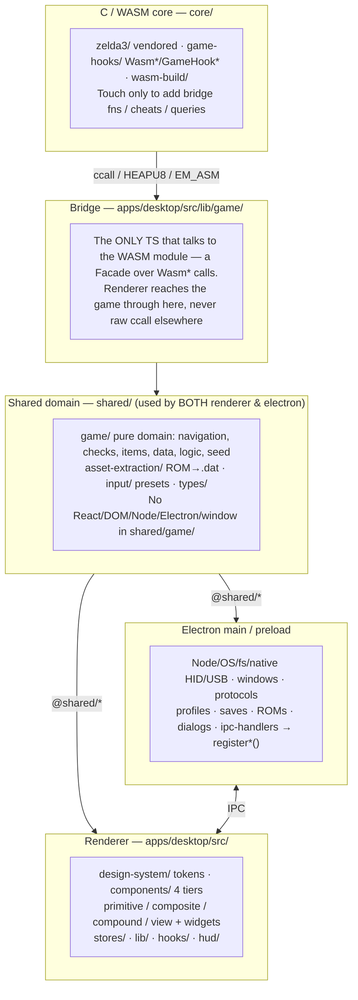

<!-- @layer docs @kind doc -->
# Architecture — Zones, Boundaries & Where Code Goes

The map for keeping this project structured: the zones, the dependency invariants
that must hold, and a placement guide for new code. Every feature is analyzed against
this before code is written (see the `architecture` skill).

Companion docs: @docs/contributing/design-system.md (UI tiers), @docs/contributing/coding-standards.md (file
rules), and the `refactoring-guru` skill (patterns/smells). Build/bridge specifics:
the `electron`, `add-wasm-function`, `build-wasm` skills.

## Zones

Aliases: `@shared/*` → `shared/`, `@app/*` → `apps/desktop/src/`.

## Dependency invariants

1. `shared/*` is the leaf. It imports only other `shared/*` plus stdlib, never
   `@app/*` and never `electron`.
2. `shared/game/*` is pure: no React, no DOM, no Node, no Electron, no `window`.
   It must run in a plain test process.
3. The renderer (`@app/*`) may import `@shared/*`, design tokens, and `window.api`.
   It cannot import from `apps/desktop/electron/*`; cross that boundary only
   through IPC.
4. Electron (`apps/desktop/electron/*`) may import `@shared/*`. It cannot import
   renderer code (`@app/*`) or React.
5. The WASM module is reached only through `lib/game/`, the bridge Facade. No raw
   `ccall`/`HEAPU8` lives outside it.
6. Bare UI tiers (primitive/composite/compound) cannot import stores,
   `window.api`, `lib/game`, or navigation. Data flows in via props, and Views do
   the wiring. See @docs/contributing/design-system.md.
7. Native modules (`node-hid`, `usb`) live in electron main/worker only.
8. `core/` C is edited only per the bridge rules (`add-wasm-function`).

If a change would break an invariant, the code is in the wrong zone. Re-place it.

## Placement guide — "I'm adding X, where does it go?"

| The new code… | Goes in | Notes |
|----------------|---------|-------|
| Needs Node/OS/fs/native, windows, ROM/profile/save IO | `apps/desktop/electron/<domain>/` behind a `domain:action` IPC handler | Add the channel to the `shared/ipc/` contract + join map (`window.api` type derives). Use the `electron` skill. |
| Talks to the running game / WASM | `apps/desktop/src/lib/game/` | New C function → `add-wasm-function` (C + bridge; `EMSCRIPTEN_KEEPALIVE` auto-exports — no export list). |
| Pure game rule/algorithm/data, no React/Node | `shared/game/` (navigation / checks / items / data / logic / seed) | Must stay pure & testable. |
| Parses a ROM / builds assets | `shared/asset-extraction/` | One `compile-*` per domain. |
| Type shared by renderer + electron | `shared/types/` | Otherwise a local `types.ts`. |
| Generic UI atom (Button, Select) | `ui/design-system/primitives/` | presentational, no data |
| Generic structural combo (Card, Dialog, Overlay) | `ui/design-system/composites/` | presentational, no data |
| Domain-specific presentational card/form (ProfileCard, SaveSlot) | `ui/domains/app/compounds/` | takes a domain prop, fetches nothing |
| Feature/page with logic + data | `ui/domains/app/views/` or `ui/domains/widgets/` | owns stores/IPC/game; logic in `behavior/` |
| Renderer UI state | `apps/desktop/src/stores/` | Zustand |
| Shared renderer hook | `apps/desktop/src/hooks/` | non-feature-specific |
| Pure renderer helper | `apps/desktop/src/utils/` | no side effects |

## The rule: analyze before building

Before writing a feature, run the architecture analysis (the `architecture` skill):

1. Decompose the feature into pieces: UI, state, domain logic, data/IO, bridge, C.
2. Place each piece via the guide above.
3. Verify the dependency invariants hold for every placement.
4. Run a pattern pass (`refactoring-guru`) and name the pattern(s) each piece uses.
5. Emit the plan per @docs/contributing/plan-format.md, with a CRUD filetree, the data model in TS, and the flow.

No feature work starts without this analysis and a plan.
