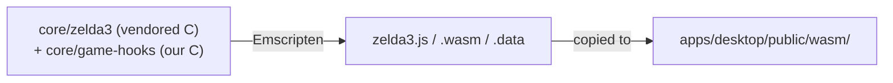

<!-- @layer docs @kind doc -->
# The WASM Bridge

The bridge is the seam where TypeScript talks to the compiled C game core, and it's
the hardest part of the codebase to reason about. This page is the mental model; the
full function list is the [Game Hooks Reference](../hooks/overview.md).

## What gets built



`core/game-hooks/` is our layer. Every `Wasm*` export and `GameHook_*` callback lives here, or in
`core/wasm-build/emscripten_*.c`. `core/zelda3/` is vendored: touch it only to insert a hook
call-site at a gameplay event. Rebuilding WASM is a separate manual step (the `build-wasm` skill);
the TS app loads a committed prebuilt module, so day-to-day work needs no Emscripten SDK.

## The two directions

| Direction | Mechanism | Where |
|-----------|-----------|-------|
| JS → C | `mod.ccall('Wasm…', ret, argTypes, args)` | wrappers in `apps/desktop/src/lib/game/` |
| C → JS | `EM_ASM(window.__on…(...))` | C in `game-hooks/`, handlers in the renderer |

The bridge module (`lib/game/`) is a Facade: it's the only TypeScript allowed to touch the WASM
module. The renderer reaches the game through it, with no raw `ccall`/`HEAPU8` elsewhere, an
[architecture invariant](overview.md).

```
apps/desktop/src/lib/game/
├── wasm-bridge.ts        singleton module ref + a few core ccalls
├── bridge/               grouped ccall facades (commands, render, ui-state,
│                         progress, room-grids, room-layout, room-doors,
│                         sprites-blockers, nav-tables)
├── cheats.ts  delivery-queue.ts  randomizer.ts  live-settings.ts
├── save-states.ts  sram-sync.ts  auto-save.ts  fps.ts
├── tracker/  haptic-polling.ts   ui-bridge*.ts  (parsers for the state buffers)
```

## Returning data across the boundary

C can't return a struct, so a query writes into a static buffer and returns its address; JS reads the
bytes from the heap (little-endian, parse immediately):

```ts
const ptr  = mod.ccall('WasmGetInventoryState', 'number', [], []);
const bytes = mod.HEAPU8.subarray(ptr, ptr + 40);
```

The parsers in `lib/game/bridge/ui-bridge-parser.ts` and `tracker/` turn those buffers into typed
objects. Each buffer's layout is documented per-function in the [hooks reference](../hooks/overview.md).

## The 2-place rule

Adding a boundary function touches two places:

1. The C impl in `core/game-hooks/*.c`, tagged `EMSCRIPTEN_KEEPALIVE`. That
   attribute both retains and exports the symbol, so there is no
   `EXPORTED_FUNCTIONS` list to edit, and none to keep in sync between `build.bat`
   and `Makefile`.
2. The JS `ccall` wrapper in `lib/game/`.

Then rebuild WASM. Forget the `KEEPALIVE` tag and the symbol won't be callable; skip the rebuild and C
edits don't take effect. Full procedure: [Adding a WASM Function](../contributing/adding-a-wasm-function.md).
