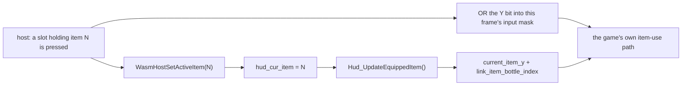

<!-- @layer docs @kind doc -->
# Host Menu & Modern Controls

The host takes over the pause menu and the equipped-item register. The game keeps running its own
menu module underneath. The native browse state is held in place, so the renderer can draw
its own screen over it and hand the results back through six exports.

**Source:** `core/game-hooks/host_menu.c`, `core/game-hooks/host_menu_gear.c` ·
**Bridge:** `lib/game/host-menu.ts`, `lib/game/gear-ownership.ts`

## The two gates

Both live in gate word 2 (`kRam_Features2`, `core/zelda3/src/features.h`, the hand-authored range above the generated bug-fix bits; word 3 is full) and both are in
`kGateWordParityMask`, so Vanilla Safe strips them.

| Bit | Value | Grants |
|-----|------:|--------|
| `kFeatures2_HostMenu` | `134217728` (`1 << 27`) | Holding the native browse state, gear writes, the 24-entry inventory lookup |
| `kFeatures2_ModernControls` | `268435456` (`1 << 28`) | Driving the active-item register from the host |

`ModernControlsGate()` (`game_hooks_internal.h`) tests **both** bits, not just its own. The ids the
host sends are the 24-entry set, and the 24-entry lookup table is only selected while `HostMenu` is
also open. With `ModernControls` alone, a bottle id would index the 21-entry table out of bounds.
The renderer sets the two together; the gate does not rely on it.

## Exports

| Function | Signature | Gate | Effect |
|----------|-----------|------|--------|
| `WasmHostMenuSetTakeover` | `void(int on)` | HostMenu (deferred) | Records the host's standing takeover request. Like `WasmSetHudHidden`, the request is kept whatever the gate currently says and resolved at each use, so a settings push that lands before the gate word reaches WRAM is not dropped. |
| `WasmHostMenuClose` | `void(void)` | HostMenu | The "continue" exit: `overworld_map_state = 5`, `sound_effect_2 = 18`, which is exactly where the vanilla Start-button branch sends the menu state machine. |
| `WasmHostMenuSaveAndQuit` | `void(void)` | HostMenu | The "save and quit" exit: rebuilds the HUD, resets the menu state machine, then hands off to the save-and-quit module at its fade submodule. |
| `WasmHostSetActiveItem` | `void(int hudItem)` | ModernControls | Writes `hud_cur_item` (0-24) and re-derives `current_item_y` through `Hud_UpdateEquippedItem()`. No-op when the value is unchanged. |
| `WasmHostMenuIsHolding` | `int(void)` | HostMenu | `1` while the takeover is in force and the gate allows it. For the host's re-assert after a save-state load. |
| `WasmHostSetGear` | `void(int kind, int tier)` | HostMenu | `kind`: `0` sword (0-4), `1` shield (0-3), `2` mail (0-2), `3` arrow type (0-1). Writes the field, reloads the gear palettes, refreshes the gloves color, and queues a HUD update. `tier` is clamped into the kind's range instead of refused. |

### The fourth gear kind is not a tier

Three of the four fields `WasmHostSetGear` writes hold one fact each, so the tier the host sends is
the whole value. The fourth does not. The launcher register packs two facts into one byte:

| value | means |
|------:|-------|
| `0` | no launcher at all |
| `1` | plain, nothing on hand |
| `2` | plain, carrying |
| `3` | silver, nothing on hand |
| `4` | silver, carrying |

So the type is the step of two and "is anything on hand" is the remaining half. `kind` `3` therefore
takes a **type**, `0` or `1`, and the C side derives the byte from that type plus the carrying half
read back out of the live value, so `1`↔`3` and `2`↔`4`, never `2`→`3`. A write computed from the type
alone would empty a full quiver or hand over a free supply, which is the one thing a menu about
which ammunition is nocked must not do.

`0` is left alone in both directions: a save holding no launcher is refused (the call returns without
writing, and without the HUD update the tail would otherwise queue), and no type ever writes a `0`.
Granting the launcher is a pickup, not a menu row. The host's own ladder has two rungs for the same
reason (see `shared/game/logic/pause/gear-tiers.ts`).

Ownership is host-side: `lib/game/gear-ownership.ts` keeps a high-water mark per ladder per profile,
and the arrow row's mark is the highest **type** ever observed, not the raw register, whose other
half moves with every shot.

Both exits guard on the pause menu actually being the running module (main module `14`, messaging
submodule `1`). `overworld_map_state` is shared with the dungeon map and the overworld map, which
run under the same main module on other submodules.

## The three vendored call-sites

`core/zelda3/src/hud.c` carries one call each; all the logic is in `host_menu.c`.

| Call-site | Hook | Effect when true |
|-----------|------|------------------|
| `Hud_NormalMenu`, first statement | `GameHook_HostMenuHolds()` | Return immediately: no input handling, no cursor movement, no tilemap redraw. The hook ticks `timer_for_flashing_circle` in the held function's place, since the host's cursor art is timed off it. |
| `Hud_ChooseNextMode` | `GameHook_HostMenuSkipsBottleMenu()` | Never enter the native bottle sub-menu; the 24-entry ids give the four bottles slots of their own. |
| `Hud_LookupInventoryItem` | `GameHook_HostMenuNewStyleItems()` | Select the 24-entry table, which is what makes ids `21`-`24` (bottles) and `16` (shovel) resolve at all. |

## How an item fires without a lane table

The game has exactly one equipped-item register, `hud_cur_item`, and `Hud_UpdateEquippedItem()` is
what turns it into `current_item_y` (and the bottle index). So the host writes that register and ORs
the **Y** bit into the same frame's input; the game's own item path does the rest. Sword ORs **B**,
action ORs **A**. No new WRAM, no new recorded bytes, no change to the player code, and it scales to
any number of buttons and all 24 ids.

Item ids are the core's 24-entry set: `1`-`24`, where `13` is the flute, `16` the shovel and
`21`-`24` the four bottles.

## Reconcile and teardown

There is no per-frame reconcile here, unlike [`hud_override.c`](rendering-settings.md). The hide
masks are state the NMI consumes elsewhere, so a request that arrived before its gate had to be
remembered and re-resolved every frame. The hold is not state: it is a question the vendored menu
asks once per frame, at the moment it matters, and every export re-reads the gate at its own call.
Order of arrival therefore cannot strand anything.

What does need undoing is `hud_cur_item`. While the gate is open the host may park a 24-entry id in
it, and the 21-entry fallback table has no such row. `HostMenu_Restore()` maps a bottle id back
to the shared bottle slot and the shovel to the flute, then re-derives `current_item_y`.
`zelda_rtl.c` calls it from `GateWordSideEffects`, i.e. **after** the bit clears, because the lookup
it runs picks its table from that very bit.

The out-of-range half of that clamp is unconditional, so it also rescues a save state written during
a takeover and loaded in a session that never had one: the gate word restores, mismatches what the
host wants, and the teardown that follows puts the id back in range before anything looks it up.

## State bytes

`WasmGetGameUIState` (`ui_state.c`) carries two bytes for this feature:

| Offset | Value |
|-------:|-------|
| `131` | `1` while the takeover is in force and the gate allows it |
| `132` | the live `hud_cur_item` |

Byte `132` repeats byte `14` deliberately. Byte `14` is the HUD's equipped-item readout; this one is
the host's own register read back, so the host can see when the native menu moved it and re-assert.
It can move: `Hud_Init` runs `Hud_SearchForEquippedItem()` at menu state 1, before the hold takes
effect at browse state 4, and that walks the 21-entry grid, so any id the 21-entry table has no row
for (an empty bottle, or the shovel) is replaced before the host ever sees the menu open.
