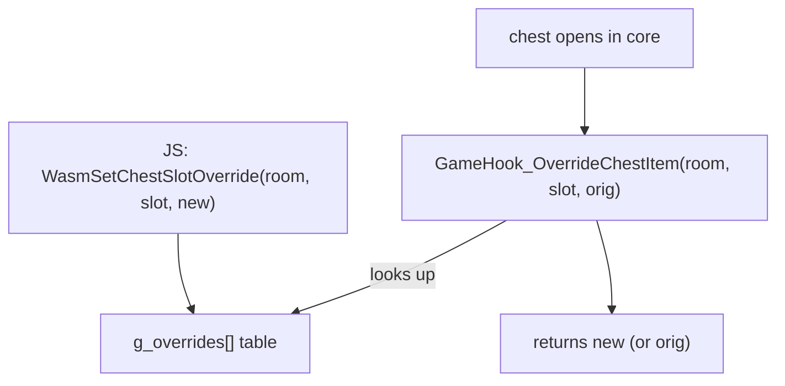

<!-- @layer docs @kind doc -->
# Item Overrides

The randomizer primitive: replace the item a given chest yields. JS registers `(room, chestSlot)
→ newItem` mappings; the game core consults the table when a chest opens. The slot is the chest's
ordinal within its room (the Nth chest-table entry for that room), so two chests in one room with
identical vanilla contents can carry two different overrides.

**Source:** `core/game-hooks/item_overrides.c` · **Bridge:** `lib/game/randomizer.ts`

| Function | Signature | Effect |
|----------|-----------|--------|
| `WasmSetChestSlotOverride` | `void(int room_id, int slot, int new_item)` | Add or update an override. Matches on `(room_id, slot)`; updates `new_item` if the pair already exists. Table holds up to 256 entries. |
| `WasmClearItemOverrides` | `void(void)` | Empty the override table. |

## How it's applied (C → C, no JS event)

When a chest opens, the vendored game code calls the callback `GameHook_OverrideChestItem(room_id,
slot, original_item)`. It scans the override table and returns the replacement item id, or the
original if none matches. A refused open (the chest stayed locked) passes through untouched. This
is a pure C→C hook; see [Callbacks](callbacks.md) for the full callback surface.

