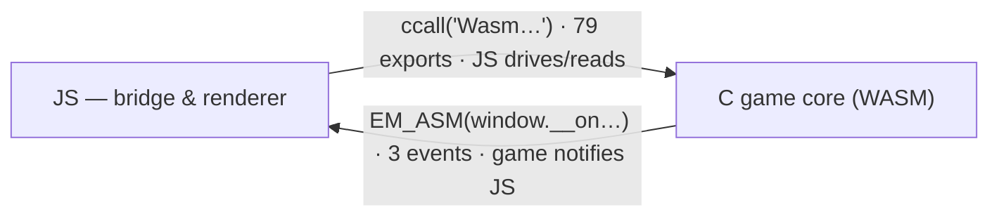

<!-- @layer docs @kind doc -->
# Game Hooks Reference — the C↔JS boundary

This section documents every function that crosses the boundary between the WebAssembly game
core and the TypeScript app: the `Wasm*` exports JS calls into, and the `GameHook_*` callbacks the
game fires out to JS. If you want to read or drive the running game, this is the surface.

> New to the bridge? Read [Architecture → The WASM Bridge](../architecture/wasm-bridge.md) first for
> the mental model; this section is the exhaustive catalogue.

## Two directions



- **JS → C**: every export is a C function marked `EMSCRIPTEN_KEEPALIVE`. JS reaches it through a
  thin wrapper in `apps/web/src/lib/game/`, the bridge, via `mod.ccall(name, ret, argTypes, args)`.
- **C → JS**: the game core fires `GameHook_*` functions at gameplay events; the JS-facing ones use
  `EM_ASM` to call a `window.__on*` callback the renderer registered.

## Returning data: the `HEAPU8` pointer convention

C cannot hand a struct to JS. Instead, a query writes into a static byte buffer and returns its
address (`return (int)buf;`). JS reads the bytes out of the WASM heap:

```ts
const ptr = mod.ccall('WasmGetInventoryState', 'number', [], []);
const view = mod.HEAPU8.subarray(ptr, ptr + 40);   // copy/parse the documented layout
```

Multi-byte values are little-endian (`lo, hi`). Buffers are static and reused, so read and parse
immediately rather than holding the pointer across frames. Each function page below gives the exact
byte-by-byte layout.

## The 2-place rule (adding a function)

A new boundary function touches two places; miss one and it won't be callable:

1. **C impl** in `core/game-hooks/*.c` (or `core/wasm-build/emscripten_*.c`) marked `EMSCRIPTEN_KEEPALIVE`.
2. **JS wrapper** — the `ccall` site in `apps/web/src/lib/game/`.

Full procedure: the `add-wasm-function` skill and [Contributing → Adding a WASM Function](../contributing/adding-a-wasm-function.md).

> **Export note.** `EMSCRIPTEN_KEEPALIVE` both retains and exports a symbol, so it is the single
> source of truth for what's callable; the build files carry no explicit `EXPORTED_FUNCTIONS`
> list. A hand-maintained list once lived in both `build.bat` and `Makefile` and drifted; since it
> was redundant with `KEEPALIVE`, it has been removed.
>
> **Headless / automation exports.** A few exports (`WasmInitHeadless`, `WasmSetInputMode`,
> `WasmLoadSram`, `WasmGetFeatures`, `WasmGetPpuRenderFlags`, `WasmGetRoomCollisionTypeForRoom`) are
> driven by the headless / `--command` startup path — Node scripts, `--auto-state` / `--screenshot` /
> `--dump-*` — rather than the interactive renderer, so they have no renderer `ccall` by design. This is
> intentional, so dead-code sweeps should not flag them.

## The catalogue (79 exports, by category)

| Category | Count | Page | Source |
|----------|------:|------|--------|
| State Queries — Inventory & Progress | 9 | [→](state-queries-inventory.md) | `state_queries.c`, `ui_state.c` |
| State Queries — Rooms & Collision | 15 | [→](state-queries-rooms.md) | `state_queries.c`, `state_queries_grids.c`, `state_queries_rooms.c`, `state_queries_room_exits.c` |
| State Queries — Navigation Tables | 6 | [→](state-queries-navigation.md) | `state_queries_tables.c` |
| State Queries — Sprites | 4 | [→](state-queries-sprites.md) | `state_queries_sprites.c`, `state_queries_grids.c` |
| Cheats & Commands | 21 | [→](cheats-commands.md) | `cheats.c`, `check_triggers.c`, `emscripten_api.c` |
| Rendering & Settings | 12 | [→](rendering-settings.md) | `emscripten_api.c` |
| Audio | 3 | [→](audio.md) | `emscripten_api.c` |
| Save / Load / I-O | 7 | [→](save-load-io.md) | `emscripten_io.c` |
| Item Overrides | 2 | [→](item-overrides.md) | `item_overrides.c` |
| **C→JS callbacks** | 14 | [→](callbacks.md) | `haptic_events.c`, `game_hooks.c`, `check_triggers.c`, `item_overrides.c`, `cheats.c` |

## Conventions used on every page

- **Source** — the `core/…` file plus the C signature, verified against the source rather than paraphrased.
- **Bridge** — the `lib/game/…` module that owns the `ccall` wrapper.
- **Returns** — for buffer-returning queries, the byte layout (offsets are bytes; `u16 = lo,hi`).
- Pointers are into `mod.HEAPU8`; `void` exports take effect on the next frame.
